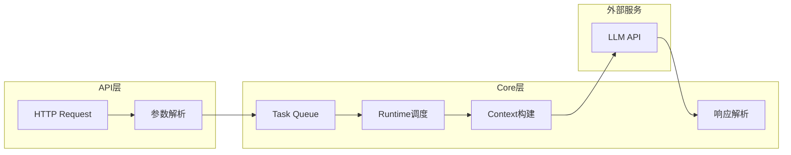

# Milestone - 0.1

## 目标

实现从API到Transport通路顺利跑通

```mermaid
flowchart LR
  subgraph API层
    A1[HTTP Request]
    A2[参数解析]
  end

  subgraph Core层
    Q[Task Queue]
    R1[Runtime调度]
    R2[Context构建]
    R3[响应解析]
  end

  subgraph 外部服务
    LLM[LLM API]
  end

  A1 --> A2 --> Q
  Q --> R1 --> R2 --> LLM
  LLM --> R3
```
当前里程碑目标只需实现最小功能,不要完整的架构

## 约束
- Runtime只需要对Context做简单的数据封装
- Runtime只需要简单的将Context从JSON转化成TOON格式
- Context只需要能够实现目标的最小数据结构即可
- 只需要实现输出LLM的内容即可
